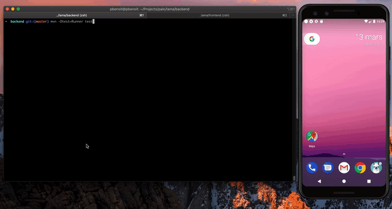

Purpose
====

This project is an example of a simple Flutter application, connected to a lambda function and with set of E2E tests. You can use it to play with the tets for the first time and be familiar with a simple REST connexion.

How Install this repo
--

    git clone https://github.com/pognibenepalo/lama.git

How to run the backend locally
--

Navigate to `backend` folder and run `mvn -Dtest=Runner test`
    

How to run the frontend
--

Navigate to `frontend` and run `flutter run`

How to run the E2E tests
--

To run the classic flutter tests from the command line:

    flutter drive --target=test_driver/app.dart

If you want to run behaviour tests writes in Gherkin from command line:

    dart test_driver/test_config.dart
